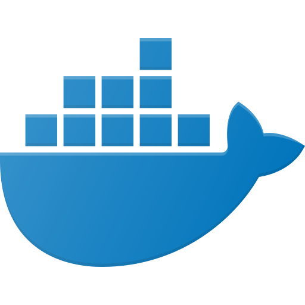

<a href="https://www.flaticon.com/free-icons/docker"></a>

# curiOS — container images built from source

[](https://www.gnu.org/licenses/old-licenses/gpl-2.0.en.html)
[](https://github.com/kernelkit/curiOS/releases)

curiOS builds container images with [Buildroot][0].  Every byte in them
was cross-compiled from source, which means each image can say exactly
what it contains, under which licenses, and against which CVEs.

It is a Buildroot `BR2_EXTERNAL` tree and nothing more.  If you know
Buildroot, you already know how to use it, and how to point it at your
own application.

| Image | Compressed | Layers | What you get |
|---|--:|--:|---|
| **curios-httpd** | 262 KiB | 1 | a working HTTP server |
| **curios-nftables** | 664 KiB | 1 | nft plus ruleset lifecycle |
| **curios-ntpd** | 955 KiB | 1 | ISC ntpd |
| **curios** | 9.4 MiB | 1 | full BusyBox staging system |
| static-debian12 | 699 KiB | 12 | nothing -- CA certs and tzdata |
| busybox | 2.1 MiB | 1 | shell and coreutils, no service |
| alpine | 3.7 MiB | 1 | package manager, no service |
| nginx | 27.4 MiB | 8 | an HTTP server |

<sub>amd64, measured with `utils/size-table`.</sub>

The comparison is the point: `curios-httpd` is a *working web server* in
less space than Google's distroless base spends on an empty rootfs, and
about a hundredth of `nginx:alpine`.  There is no package manager, no
shell where the service does not need one, and nothing that was not
asked for.

## Build an image for your own application

The five images below are examples.  The reason to build containers with
Buildroot is that it cross-compiles *your* daemon:

```sh
make new-container NAME=mydaemon ARGS="--package --cmd /usr/sbin/mydaemon"
```

That writes defconfigs for every architecture, a board directory, and a
Buildroot package building from `src/mydaemon/`.  Put your code there —
or point the `.mk` at your release tarball — and build:

```sh
make mydaemon_amd64_defconfig
make
podman load < output/images/curios-mydaemon-oci-x86_64.tar.gz
```

See [CONTRIBUTING.md](.github/CONTRIBUTING.md) for the longer version.

## Supply chain

Every release carries what an auditor asks for, generated from the build
rather than asserted after it:

| Artifact | How |
|---|---|
| SPDX 2.3 and CycloneDX 1.6 SBOM | `make sbom` |
| License manifest and complete source | Buildroot `legal-info` |
| CVE report per image | nightly `pkg-stats` against NVD |
| Sigstore signature | keyless, from GitHub OIDC |
| SLSA build provenance | `actions/attest-build-provenance` |

This matters if you sell into the EU.  CRA vulnerability reporting
obligations [applied from 11 September 2026][11], and an SBOM belongs in
the technical documentation [from 11 December 2027][12].  You cannot
report on a component you cannot name.

Verify what you pulled:

```sh
cosign verify ghcr.io/kernelkit/curios-httpd:latest \
  --certificate-identity-regexp='^https://github.com/kernelkit/curiOS/' \
  --certificate-oidc-issuer=https://token.actions.githubusercontent.com
```

Generate the SBOM for a local build:

```sh
make httpd_amd64_defconfig
make sbom
ls output/images/sbom/
```

> [!NOTE]
> All defconfigs link statically, so the GPL components in these images
> come with an obligation to offer source.  `make sbom` collects it, via
> Buildroot's `legal-info`, in `output/legal-info/sources/`.

## Health checks

Each service image declares a `HEALTHCHECK`, so an orchestrator sees more
than "the process has not exited yet":

```sh
podman run -d --name web ghcr.io/kernelkit/curios-httpd:latest
podman inspect --format '{{.State.Health.Status}}' web
```

The probe is `/usr/libexec/curios/curios-health`, which reads
`/proc/net` directly:

```
curios-health [-q] CHECK ...

  tcp:PORT    a socket is listening on TCP PORT
  udp:PORT    a socket is bound to UDP PORT
  proc:NAME   a process named NAME is running
  file:PATH   PATH exists
```

Images with a shell get an ash implementation out of the common overlay;
`curios-ntpd`, which has none, gets a static C one.  A container declares
its own check in `board/<name>/rootfs/usr/libexec/curios/healthcheck.json`.

## Images

Pre-built images for `amd64`, `arm64`, `armv7` and `riscv64` are on the
[KernelKit Container Registry][2].  The `system` image is `amd64` and
`arm64` only.

### [curiOS system][3]

The staging container: full BusyBox, plus the tools you want when
something is wrong on a device rather than on your desk — Dropbear SSH,
mini-snmpd, netopeer2-cli, nftables, ntpd, tcpdump, mg, mcjoin, mping.

See [Infix Advanced Container Networking](https://kernelkit.org/posts/advanced-containers/).

### [curiOS httpd][6]

BusyBox httpd.  Mount your content at `/var/www/`.

```sh
podman run -p 8080:8080 -v ./site:/var/www:ro \
  ghcr.io/kernelkit/curios-httpd:latest /usr/sbin/httpd -f -v -p 8080
```

### [curiOS nftables][5]

Netfilter in a container, with the ruleset loaded at start and flushed at
stop.  `ENABLE_INTERFACES` is a space-separated list of interfaces to
bring up after the rules are applied, and take down before they are
removed.

```sh
podman run --network=host --cap-add NET_ADMIN --cap-add NET_RAW \
  -e ENABLE_INTERFACES="e1 e24" \
  -v /path/to/nftables.conf:/etc/nftables.conf:ro \
  ghcr.io/kernelkit/curios-nftables:latest
```

Samples in [doc/](doc/).  See [Infix w/ WAN+LAN firewall setup](https://kernelkit.org/posts/firewall-container/).

### [curiOS ntpd][4]

ISC ntpd, `-n -g`, with multicast NTP.  Mount `/var/lib` to keep drift
across restarts, and `/etc/ntp.conf` to configure it.  No shell.

### [curiOS neofetch][7]

System information, for demos.

```sh
podman run --rm ghcr.io/kernelkit/curios-neofetch:latest
```

## Running on Infix

curiOS is built by the team behind [Infix][8], an immutable embedded
Linux modelled end to end in YANG.  Infix runs containers under podman
and configures them over NETCONF, and — because it uses switchdev — can
hand a container a *physical switch port*, not a veth into a bridge:

```
admin@example:/> configure
admin@example:/config/> edit interface e1
admin@example:/config/interface/e1/> set container-network
admin@example:/config/interface/e1/> end
admin@example:/config/> edit container fw
admin@example:/config/container/fw/> set image docker://ghcr.io/kernelkit/curios-nftables:latest
admin@example:/config/container/fw/> set network interface e1
admin@example:/config/container/fw/> leave
```

Ready-made configurations are in [doc/infix/](doc/infix/).  You do not
need Infix to use curiOS, and you do not need curiOS to use Infix.

## Getting images

```sh
# From the registry
podman pull ghcr.io/kernelkit/curios-nftables:latest
podman pull ghcr.io/kernelkit/curios-nftables:1.2.3
podman pull ghcr.io/kernelkit/curios-nftables:edge

# From a release tarball, for air-gapped sites
wget https://github.com/kernelkit/curiOS/releases/download/v1.2.3/curios-nftables-oci-amd64-v1.2.3.tar.gz
sha256sum -c curios-nftables-oci-amd64-v1.2.3.tar.gz.sha256
podman load < curios-nftables-oci-amd64-v1.2.3.tar.gz
```

## Building

```sh
git clone https://github.com/kernelkit/curiOS.git
cd curiOS
git submodule update --init --recursive

make nftables_amd64_defconfig      # or _arm64_, _armv7_, _riscv64_
make

podman load < output/images/curios-nftables-oci-x86_64.tar.gz
```

Customising is Buildroot as usual — `make menuconfig`, then `make
savedefconfig`.

Run the tests against what you built:

```sh
make test
```

## Origin

curiOS started as a fork of <https://github.com/brianredbeard/coreos_buildroot>.

[0]: https://buildroot.org
[2]: https://github.com/orgs/kernelkit/packages?repo_name=curiOS
[3]: https://github.com/orgs/kernelkit/packages/container/package/curios
[4]: https://github.com/orgs/kernelkit/packages/container/package/curios-ntpd
[5]: https://github.com/orgs/kernelkit/packages/container/package/curios-nftables
[6]: https://github.com/orgs/kernelkit/packages/container/package/curios-httpd
[7]: https://github.com/orgs/kernelkit/packages/container/package/curios-neofetch
[8]: https://github.com/kernelkit/infix
[11]: https://digital-strategy.ec.europa.eu/en/policies/cra-reporting
[12]: https://digital-strategy.ec.europa.eu/en/policies/cyber-resilience-act
